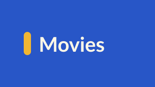
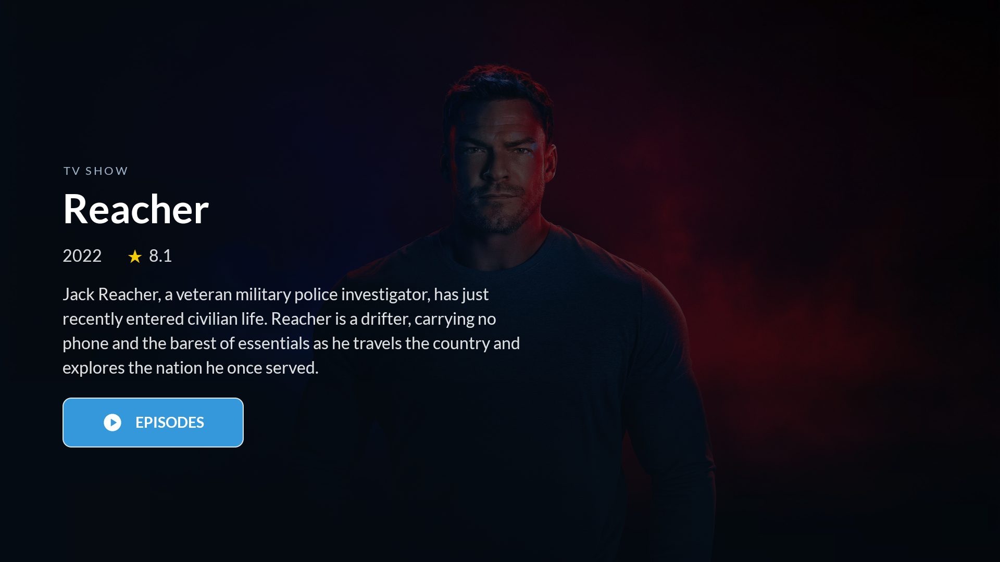
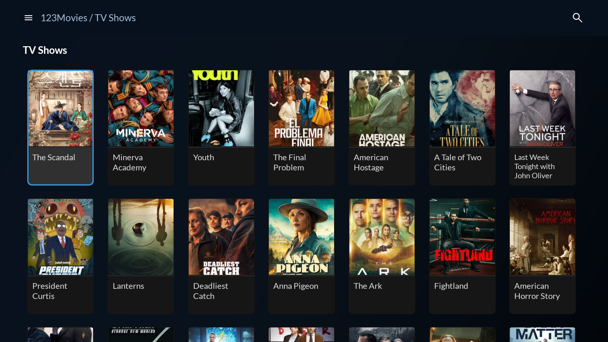
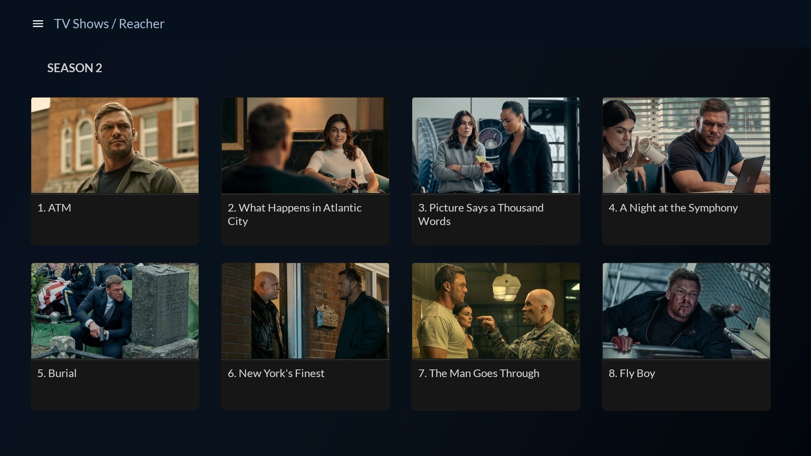
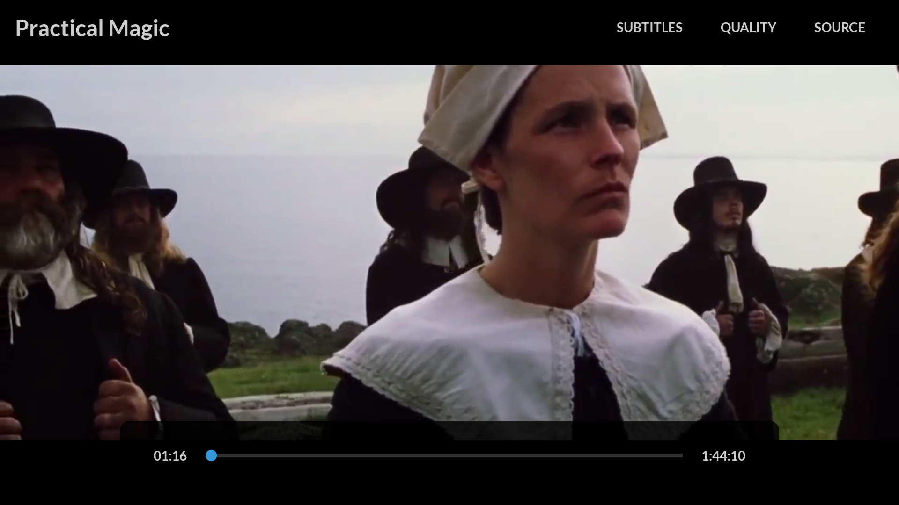

  

<h1 align="center">Settle in. Press play.</h1>

  Movies, series and spectacles in one app, built for your Android TV. 
  Browse with your remote. Search with your phone. Pick up where you left off.

  <a href="#a-good-night-starts-with-a-good-browse">Explore</a> ·
  <a href="#three-sites-one-familiar-experience">Supported sites</a> ·
  <a href="#get-movies-stream">Get started</a>

## A good night starts with a good browse

Explore movies and TV shows in a poster gallery made for the big screen. Keep
moving down to discover more, open a title for its story and rating, then choose
**Watch** or **Episodes**. Large text and clear focus make every step easy to
follow from the couch.

### Type on your phone. Watch on your TV.

Open Search, scan the QR code and use your phone's keyboard. Results appear on
the TV, ready to browse with the remote. Your phone and TV just need to be on the
same network. You can also enter a query directly on the TV.

## Tonight's episode. Tomorrow's too.

Choose a season, pick an episode and let the series continue. The next episode
starts automatically—even across seasons when available. Your subtitle language
follows you into the next episode.

**Taking a break?** Continue Watching brings unfinished movies and episodes back
to the home screen. Playback position and your subtitle choice are remembered,
including after restarting the app. Each site keeps its own history, with movies
and TV shows in their respective sections.

## Everything you need, within reach

Full-screen playback keeps the focus on what you're watching. Press **Up** for
**Subtitles**, **Quality** and **Source**, or use the remote to pause and seek.

- **Subtitles your way.** Choose available tracks or search online in French and
  English where supported. Your selection—including Off—is remembered.
- **The best available quality.** Playback starts with the highest supported
  bitrate offered by the selected stream. Choose another resolution or Auto
  without losing your place.
- **Switch sources.** Pick another supported server while keeping your playback
  position. The app remembers your choice for each site.
- **Back behaves like Back.** Dismiss a menu, hide the controls, then return to
  browsing with the physical remote button.

When a movie ends, you return to browsing. When a series ends, the player closes
after the final listed episode.

## Three sites, one familiar experience

Switch sites and sections from the hamburger menu. The browsing and playback
controls stay familiar wherever you watch.

| Site | What you'll find |
| --- | --- |
| **Vidbox** | Movies and TV shows, seasons and episodes, multiple supported sources |
| **Kopoti** | Films in **À l'affiche** and **Spectacles**, with search across its catalog |
| **123Movies** | Movies and TV shows, seasons and episodes, and available hosted subtitles |

123Movies currently supports **Server 1**. Catalogs, working sources, quality and
subtitle availability depend on the selected site and title. Movies Stream is a
player for these sites; it does not host their video catalogs.

## Get Movies Stream

You'll need **Android TV 8.0 or later**, an internet connection, and a computer to
build and sideload the app. The current installation path is a debug APK built
from source.

1. Set up JDK 17, the Android SDK and ADB using the [build guide](docs/development.md).
2. Run `make build` and install the APK on your TV, or follow the guide's deploy commands.
3. Open **Movies Stream**, choose a site and find your next watch.

**[Build and install →](docs/development.md)** · **[Remote and playback guide →](docs/user-guide.md)**

<strong>Developing or adding a site?</strong>

The app uses native Android views and Media3. Site adapters and stream extraction
live behind shared interfaces, so new catalogs reuse the existing TV experience.

Start with [AGENTS.md](AGENTS.md), the [architecture guide](docs/multi-site-design.md)
and [development commands](docs/development.md). Run `make check` for tests, lint
and a debug build.

Screenshots captured from the app on an Android TV emulator. Artwork and
catalog metadata are supplied by the selected sites.
